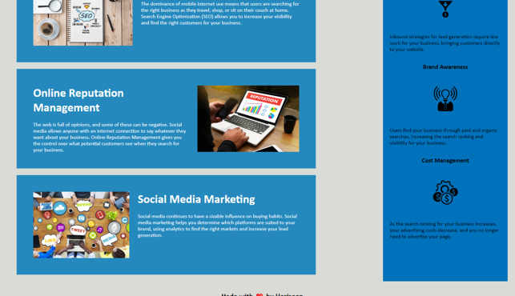

# "Horiseon Social Service Solutions"

## Customer Landing Page

&nbsp;&nbsp;&nbsp;&nbsp;This is a simple page to represent Horiseon's services and benefits to potential customers. Each item is clearly represented in its own section for readability. The page is currently static but is designed to be able to add and remove items easily for future developers. 

&#128161; **Tip:** Future development should consider the colors of items, line height, and general screen-reader accesibility.

## Screenshots

*The landing page's title and navigation*

*The landing page's section and aside*

## How to view

[Horiseon Landing Page](https://stanjosh.github.io/horiseon-landing-page/horiseon-landing-page/)

### Credits

Content originally provided by a student repository from UTA Code Bootcamp.

### License

Everyone's granted use of the page through and MIT license.